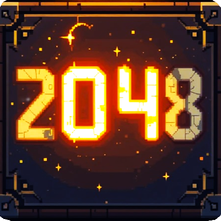

# Retro 2048 Game

<p align="center">
  
</p>

A retro-styled implementation of the classic 2048 puzzle game with custom animations, sound effects, and a nostalgic pixel art aesthetic.

## Features

- **Retro Pixel Art Style**: Enjoy the game with a nostalgic pixel art aesthetic and custom-designed tile images
- **Smooth Animations**: Tile movements, merges, and spawns are animated with retro-style effects
- **Sound Effects**: Satisfying sound effects for moves, merges, and game events
- **Game State Management**: Save and load your game progress
- **High Score Tracking**: The game remembers your best score
- **Customizable Controls**: Use arrow keys or WASD to control the game
- **Responsive Design**: The game adapts to different window sizes

## Screenshots


## How to Play

1. **Objective**: Combine tiles with the same number to create a tile with the value 2048
2. **Controls**:
   - **Arrow Keys** or **WASD**: Move tiles in the specified direction
   - **R**: Restart the game
   - **M**: Toggle sound effects
   - **ESC**: Open the in-game menu
   - **S**: Save the current game

## Installation

### Option 1: Run the Executable (Windows)

**No building required!** The executable is already included in this repository in the `dist` folder. To play the game:

1. Download or clone this repository
2. Navigate to the `dist` folder
3. Run `2048 Game.exe`

That's it! No installation or building required.

### Option 2: Run from Source

1. Clone this repository:
   ```
   git clone https://github.com/yourusername/retro-2048.git
   cd retro-2048
   ```

2. Install the required dependencies:
   ```
   pip install -r requirements.txt
   ```

3. Run the game:
   ```
   python 2048_gui.py
   ```

## Dependencies

- Python 3.6+
- Tkinter (included with most Python installations)
- NumPy
- Pillow (PIL)
- Pygame (for sound effects)

## Building the Executable

**Note:** You don't need to build the executable yourself as it's already included in the `dist` folder.

However, if you want to build it yourself:

1. Install PyInstaller:
   ```
   pip install pyinstaller
   ```

2. Build the executable:
   ```
   pyinstaller 2048_game.spec
   ```

3. The executable will be created in the `dist` folder.

## Project Structure

- `2048_gui.py`: Main game code
- `images/`: Contains all game images and tiles
- `sounds/`: Contains sound effects
- `fonts/`: Contains the pixel font used in the game
- `data/`: Stores game saves and high scores

## License

This project is licensed under the MIT License - see the [LICENSE](LICENSE) file for details.

## Acknowledgments

- Original 2048 game by Gabriele Cirulli
- Pixel art assets created for this project
- "Press Start 2P" font by CodeMan38
